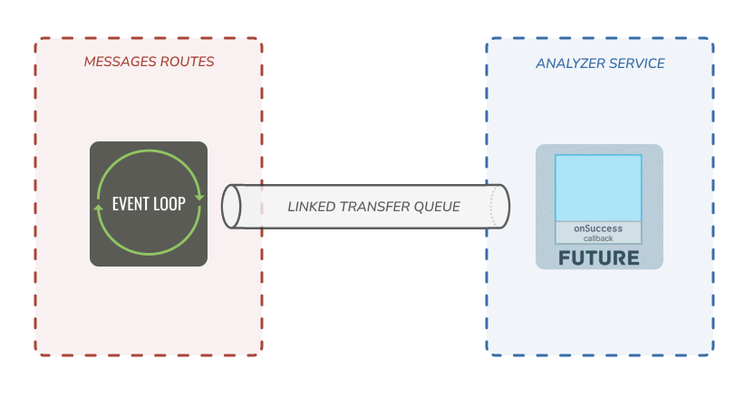

# SCALA Labos - Bot-tender Future

> ### Fonctionnalité ajoutée par rapport à la branche `origin/Labo_3` :
> 
> Gestion de commandes asynchrones en utilisant les Futures de l’API Scala.

## Choix d'implémentation

Dans cette section, nous abordons les différents choix d'implémentation effectués pour les fonctionnalités ajoutées au projet par rapport au précédent laboratoire (branche origin/Labo_3).

### Temps de préparation des produits

Une commande auprès du BOT demande maintenant un temps de préparation. 
Nous avons donc modifié notre `ProductService` afin d'y ajouter le temps de préparation pour chaque produit proposé et une méthode permettant de retourner ce dernier sous forme d'un Future (`getPreparationTime(...): Future[Unit]`).

Afin de rendre le code plus clair nous avons ajouté 2 classes internes pour représenter les informations d'un produit dans nos structures de données (Map). Voici un aperçu de la modification :

```scala
class ProductImpl extends ProductService:
  [...]

  case class Schedule(mean: Duration, std: Duration = 0.second, successRate: Double = 1.0)
  case class ProductInfo(price: Double, schedule: Schedule)

  private val croissants : Map[BrandName, ProductInfo] = Map(
    ("maison", ProductInfo(2.0, Schedule(1.second, successRate = 0.6))),
    ("cailler", ProductInfo(2.0, Schedule(1.second, successRate = 0.6))))
    
  [...]

  def getPreparationTime(product: ProductName, brand: BrandName): Future[Unit] =
    // retourne le temps de préparation en fonction du produit

  [...]
```

### Traitement des commandes en préparation

Au niveau de notre `AnalyzerService`, nous avons modifié la méthode qui traitait les commandes (`processOrder()`) afin d'y incorporer le traitement de la préparation de ces dernières. 
Ce traitement est effectué par une nouvelle méthode `prepareOrder()`.
Une fois la préparation de la commande (et des produits) terminée (traitement des Futures avec succès ou échec), un message est transmis par le bot de façon asynchrone.

Voici un aperçu de l'implémentation en pseudo code :

```scala
  def processOrder(request: ExprTree, session: Session): String =
    prepareOrder(request) transform {
      // traitement de la commande après sa préparation et envoi d'un message en conséquence du résultat
    }
    // transmission du message confirmant la préparation de la commande
```

### Envoi des messages sur le chat une fois le traitement terminé

Pour le traitement des messages asynchrones (dans notre cas suite au traitement d'une commande, une fois le temps de préparation écoulé), nous avons beaucoup réfléchi à une intégration possible avec une approche classique du langage scala.

Une solution possible était de passer un ou plusieurs paramètres dans nos classes et/ou de les passer par le retour des fonctions, mais nous avons trouvé qu'étant donné la structure du projet, cela alourdissait trop le code et ce n'était pas très propre (selon nous).

Une autre solution était de déléguer l'écriture du message à l'`AnalyzerService`, mais cela aurait changé l'objectif spécifique de la classe et nous aurions commencé à mélanger les tâches (bad pattern).

Pour résoudre ce problème, nous avons donc opté pour l'utilisation d'un channel `LinkedTransferQueue` offert par la bibliothèque standard de Java (car en Scala la classe pour cette fonctionnalité, `Channel`, est dépréciée. Java vs Scala : 1-0). 
En fait, ce channel nous permet de créer une simple voie de communication entre les deux classes, la communication ayant lieu de manière asynchrone et sans bloquer le thread principal.

Voici un schéma représentant le processus :



Dans le `AnalyserService`, une fois le traitement d'une commande terminé avec succès, une fonction callback se chargera d'envoyer le résultat grâce au channel.

Dans le `MessagesRoutes`, il y a une méthode **listener (Event Loop)** qui est déclenchée lorsqu'un événement s'est produit (l'ajout d'un message). Une fois le message reçu, il sera traité et le listener continuera à attendre d'autres messages éventuels. Si plusieurs messages arrivent en même temps, ils seront traités dans l'ordre d'arrivée et surtout sans produire de blocage.
